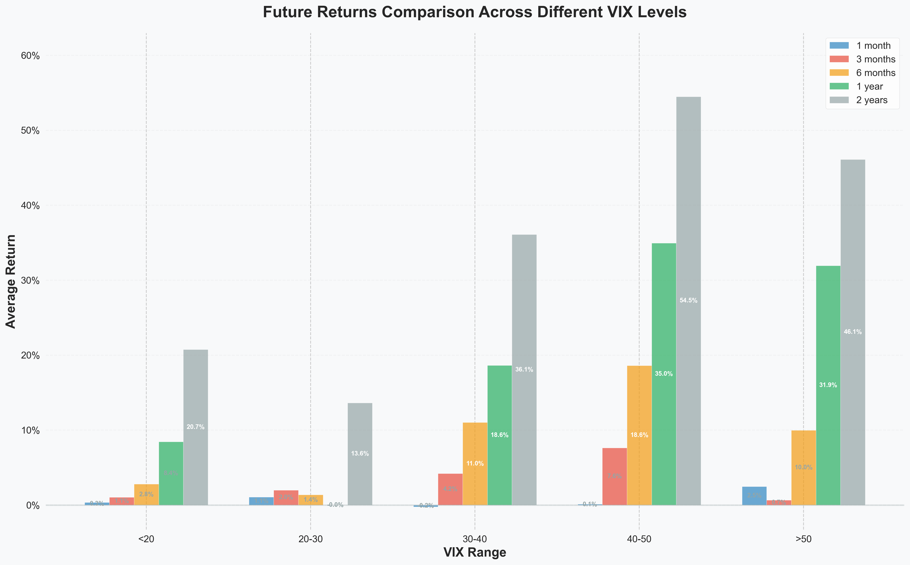

# 📊 VIX Volatility Index Analysis Report

---

    ⚠️ This content is not intended as investment advice

## 📌 Summary
- **Analysis Period**: April 5, 2007 to April 15, 2020  
- **Number of VIX Peaks Identified**: 16  
- **Historical Maximum VIX Value**: 82.69 (on March 16, 2020)  

---

## 🔍 Key Findings
1. 📉 Negative Correlation Between VIX and the Stock Market  
2. ⏱️ Recovery Duration: ~328 days  
3. 📈 Higher Long-Term Returns After High VIX Levels  

---

## 📈 VIX and S&P 500 Correlation
The VIX and S&P 500 have a moderately negative correlation of -0.4821.  
When VIX rises, it reflects increased volatility expectations and usually coincides with a falling stock market.

---

## 📊 Market Behavior Following VIX Peaks
After VIX spikes, markets experience an average drawdown of -17.33% and take around 328 days to recover.  
Correlation between VIX and drawdown is 0.5744, and between VIX and recovery time is -0.6645.

---

## 💹 Future Returns Based on VIX Levels
Future returns are higher the longer the holding period and the higher the VIX at entry.  
High VIX conditions show significantly better long-term performance (up to 100%+ over 5 years).

---

## 🔄 Cross-Period Comparison of VIX Return Effects
Returns increase across longer horizons, especially when VIX > 40.  
The most favorable performance is observed during extremely high VIX levels.

---

## 🎯 Conclusion
The VIX Index serves as a strong indicator of market sentiment.  
While volatility is high during VIX peaks, long-term returns tend to be attractive,  
suggesting that VIX can be used as a strategic timing tool.

---

    ⚠️ This content is not intended as investment advice

